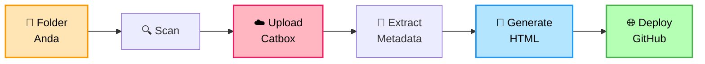
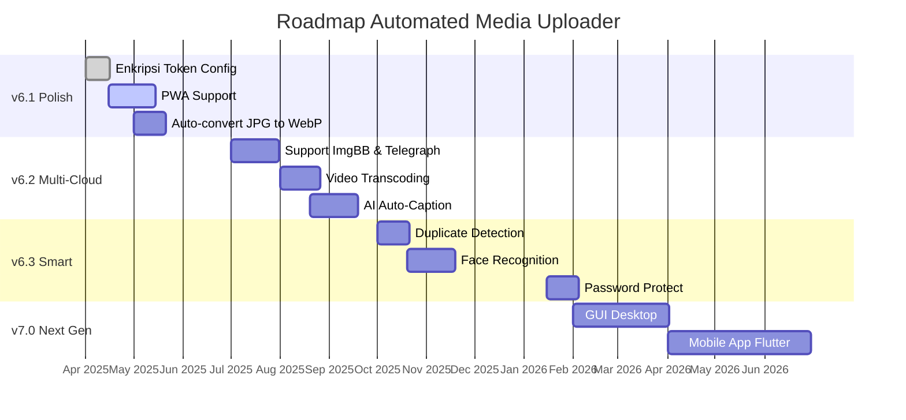

# 📸 Automated Media Uploader v6 — README.md (Versi Pendek)

```markdown
<div align="center">


<h3><i>"Repo Gratis Yang Mengubah Folder Jadi Website Yang Keren"</i></h3>

<p>


</p>

</div>

---

## 📖 Daftar Isi

<table align="center">
<tr>
<td width="50%" valign="top">

**🎯 Untuk Pemula**
- [Kenalan Dulu Yuk](#-kenalan-dulu-yuk)
- [Penawaran Spesial](#-penawaran-spesial)
- [Quick Start](#-quick-start)
- [Tutorial Lengkap](#-tutorial-lengkap)
- [Setup Userhash (WAJIB)](#-setup-userhash-catbox-wajib)

</td>
<td width="50%" valign="top">

**🚀 Untuk Lanjutan**
- [Dari Lokal ke Online](#-dari-lokal-ke-online)
- [Fitur Lengkap](#-fitur-lengkap)
- [Roadmap](#-roadmap)
- [Troubleshooting](#-troubleshooting)
- [Support & Donasi](#-support--donasi)

</td>
</tr>
</table>

---

## ✨ Kenalan Dulu Yuk

<div align="center">

### 💭 *"Foto yang tidak pernah dibuka, sama saja tidak ada."*

</div>

Berapa dari **ribuan foto** di HP Anda yang pernah dilihat **lebih dari sekali**?

- 📱 Terakhir buka galeri HP kapan? *(Scroll 5 menit, eh tiba-tiba 3 jam)*
- 🔍 Pernah nyari foto lama, tapi **tidak ketemu**?
- 😢 Ada momen penting yang **kenangannya hilang** karena HP rusak?

Foto itu bukan cuma file. Itu **memori**. Tapi begitu teronggok di HP, dia jadi:

- 📁 File `IMG_20240315_142301.jpg` yang **tidak ada artinya**
- 🗑️ Yang akan dihapus saat memori penuh
- 🕳️ Yang hilang saat HP ganti

### 🎯 Misi Script Ini

> **"Bawa memori Anda dari folder HP ke internet — agar tidak hilang, agar bisa dibuka kapan saja, agar bisa dibagikan ke orang yang Anda cintai."**

**Automated Media Uploader v6** adalah **script Python** yang mengubah folder lokal menjadi **website galeri online** — gratis, tanpa coding, tanpa hosting bulanan.

### 📊 Yang Dilakukan Script Ini



**3 menit setup. 1 klik upload. Langsung online.** 🚀

---

## 🎁 Penawaran Spesial

<div align="center">

### 📖 **DONGENG MODERN UNTUK DEWASA**

### *"Kisah Tentang Foto yang Tidak Pernah Dibuka"*

</div>

---

**Dahulu kala**, di sebuah HP yang penuh sesak...

Hiduplah **10.000 foto**. Mereka tinggal di folder-folder bernama `DCIM`, `Camera`, `WhatsApp Images`.

Setiap hari, foto-foto itu berharap... *"Semoga hari ini aku dibuka oleh tuanku."*

Tapi setiap hari, jawabannya sama: **Tidak.**

📱 Tuan mereka sibuk. Tuan mereka lupa bahwa mereka ada.

---

Suatu hari, **HP itu rusak**. Motherboard konslet. Tidak bisa dinyalakan.

**10.000 foto — lenyap. Selamanya.** Tidak ada yang menyelamatkan mereka. Karena tidak ada backup.

---

### 🌟 **TAPI...**

Di sebuah repo GitHub yang jauh, hiduplah **script Python** yang baik hati.

Namanya: **Automated Media Uploader v6**.

> **"Aku akan menyelamatkan foto-foto yang terancam hilang. Aku akan bawa mereka ke cloud. Aku akan buatkan mereka rumah baru — website galeri yang cantik. Dan semuanya, GRATIS."**

---

### 🎁 **Hadiah dari Script Ajaib:**

| Hadiah | Nilai | Harga |
|--------|:-----:|:-----:|
| 🐍 Script Python | Rp 500rb | 🆓 |
| 🏷️ Auto-tag (EXIF+OCR+Wajah) | Rp 300rb | 🆓 |
| 🎨 10 tema galeri | Rp 200rb | 🆓 |
| 📐 6 layout responsif | Rp 150rb | 🆓 |
| ☁️ Cloud backup | Rp 400rb | 🆓 |
| 🌐 Website hosting | Rp 350rb | 🆓 |
| **TOTAL** | ~~**Rp 1.900.000+**~~ | **Rp 0** |

**✨ Bonus:** View counter, peta GPS, multi-device, open source.

---

### 🚀 **Akhir Kisah Ini Terserah Anda:**

**Pilihan A:** Tutup README ini, dan tetap punya 10.000 foto yang tidak pernah dibuka.

**Pilihan B:** Ketik `git clone`, jalankan `python main.py`, dan **selamatkan memori Anda.**

### 🎯 **Pilih B.** 👇

> 💝 **Kenapa gratis?** Karena author baik hati. Kalau bermanfaat, traktir kopi saja ☕

---

## ⚡ Quick Start

```bash
# 1. Clone
git clone https://github.com/nexterade/automated-media-uploader.git
cd automated-media-uploader

# 2. Install
pip install requests requests-toolbelt Pillow

# 3. Jalankan
python main.py

# 4. Menu 1 → Setup Wizard (WAJIB isi userhash!)
# 5. Menu 3 → Upload & Generate
# 6. Buka index.html
```

**Dependencies:** `requests` (wajib) • `requests-toolbelt`, `Pillow`, `pytesseract`, `opencv-python-headless`, `ffmpeg` (opsional)

> Jika opsional tidak ada, fitur terkait **dinonaktifkan otomatis** — script tetap jalan.

---

## 📚 Tutorial Lengkap

<details>
<summary><b>Step 1: Install Python & Dependencies</b></summary>

**Termux (Android):**
```bash
pkg update && pkg upgrade -y
pkg install python git ffmpeg tesseract -y
pip install requests requests-toolbelt Pillow pytesseract opencv-python-headless
```

**Ubuntu/Debian:**
```bash
sudo apt update
sudo apt install python3 python3-pip git ffmpeg tesseract-ocr -y
pip3 install requests requests-toolbelt Pillow pytesseract opencv-python-headless
```

**Windows:** Download [Python](https://python.org) (centang **"Add to PATH"**) & [FFmpeg](https://ffmpeg.org/download.html)

</details>

<details>
<summary><b>Step 2: Folder Media — Apa yang Script Baca</b></summary>

Script **tidak mewajibkan** struktur folder atau nama file tertentu.

**Folder default:** `./media`

**Cara kategorisasi:** File di subfolder apapun → kategori = **nama folder tersebut**. File di root `media/` → kategori = **"General"**.

**Format tanggal yang dideteksi otomatis:**

| Pattern | Contoh |
|---------|--------|
| `YYYYMMDD_HHMMSS` | `20240315_143022` |
| `YYYY-MM-DD` | `2024-03-15` |
| `DD-MM-YYYY` | `15-03-2024` |
| `YYYYMMDD` | `20240315` |
| `DDMMYYYY` | `15032024` |
| `YYYY-MM` | `2024-03` |

**Contoh penamaan:** `pantai_2024-03-15.jpg` lebih baik dari `IMG_1234.jpg`

</details>

<details>
<summary><b>Step 3: Buat Shortcut (Opsional)</b></summary>

**Alias (Termux/Linux/macOS):**
```bash
nano ~/.bashrc
# Tambahkan:
alias v6='cd ~/automated-media-uploader && python main.py'
alias v6dir='cd ~/automated-media-uploader'
alias v6update='cd ~/automated-media-uploader && git pull'
# Save: Ctrl+X → Y → Enter
source ~/.bashrc
```

**Windows:** Buat `v6.bat` di folder project:
```batch
@echo off
cd /d "%~dp0"
python main.py
pause
```

</details>

<details>
<summary><b>Step 4: Jalankan & Pahami Menu</b></summary>

```bash
python main.py
```

**Menu Utama:**

| Menu | Aksi |
|:----:|------|
| **1** | ⚙️ Setup Konfigurasi (Wizard) |
| **2** | ✏️ Edit Konfigurasi Cepat |
| **3** | 🚀 Upload & Generate |
| **4** | 👁️ Preview Konfigurasi |
| **5** | 🗑️ Hapus Cache Upload |
| **6** | 🧹 Bersihkan Thumbnail |
| **7** | 📂 Cek Isi Folder Media |
| **8** | 📖 Bantuan & Tutorial |
| **9** | ⚙️ Generate Manager HTML |
| **10** | 🛠️ Tools & Utilities |
| **0** | 🔄 Reset Blacklist |
| **99** | ❌ Keluar |

**Wizard 9 Langkah:**

| Step | Field | Wajib? |
|:----:|-------|:------:|
| 1/9 | 🔑 Userhash Catbox | ⭐ **YA** |
| 2/9 | 📝 Judul Project | ✅ |
| 3/9 | 🔢 Counter Namespace | ✅ |
| 4/9 | 📁 Folder Media | ✅ |
| 5/9 | ⚙️ Workers (1-4) | ✅ |
| 6-9 | 🐙 GitHub Setup | Opsional |

</details>

---

### 🔑 Setup Userhash Catbox (WAJIB)

> ⚠️ **Kenapa WAJIB?** Dari analisis kode `upload_to_catbox()`:

**Tanpa userhash:** Rate limit ketat, sering gagal, risiko IP diblokir, tidak bisa manage file.

**Dengan userhash:** Upload stabil, bisa upload ribuan file, file terhubung ke akun Anda.

**Cara Mendapatkan:**

1. Buka [catbox.moe](https://catbox.moe) → **Create Account** → verifikasi email
2. Login → buka [catbox.moe/user/manage.php](https://catbox.moe/user/manage.php)
3. Scroll ke **"User Hash"** → **COPY** (format: 16-32 karakter hex)
4. Paste di wizard Step 1/9, atau edit manual di `config.json`:
   ```json
   { "userhash": "userhash_anda_di_sini" }
   ```

> 🔐 **Jangan share userhash** ke publik — treat seperti password!

---

### 🚀 Upload & Generate (Menu 3)

Setelah wizard selesai, pilih **menu 3**. Script menjalankan `scan_and_upload()`:

```
[1/5] 📂 Scan folder media...
[2/5] ☁️ Upload ke Catbox.moe...
[3/5] 🧠 Extract metadata...
[4/5] 📄 Generate index.html...
[5/5] ⚙️ Generate manager.html...
```

**Output akhir** (dari `print_summary_report()`):
```
📊 ATOS BERES BOSS!
📂 Total File Terdeteksi   : X file
⚡ Menggunakan Cache       : X file
✅ Berhasil Diupload       : X file
❌ Gagal Diupload          : X file
🕐 Durasi                  : Xm Xs
🌐 Kuota Internet Dipakai  : X MB
🚀 Rata-rata Kecepatan     : X MB/s
```

**Prompt:** `📤 Upload hasil ke GitHub sekarang? (y/n) [n]:`

**Buka galeri:**
```bash
termux-open index.html          # Termux
xdg-open index.html             # Linux
open index.html                 # macOS
start index.html                # Windows

# Atau via HTTP (recommended):
python -m http.server 8000
# Buka http://localhost:8000
```

---

## 🌐 Dari Lokal ke Online

### 🎯 Deploy ke GitHub Pages (GRATIS)

**Step 1: Buat Akun** — [github.com/signup](https://github.com/signup)

**Step 2: Buat Repository** — Klik `+` → **New repository** → isi nama → **Public**

**Step 3: Buat Token** — [github.com/settings/tokens](https://github.com/settings/tokens) → **Generate new token (classic)** → scope: ✅ **`repo`** → **SALIN TOKEN** (hanya muncul sekali!)

**Step 4: Aktifkan Pages** — Settings → Pages → Branch: `main`, Folder: `/ (root)` → Save

**Step 5: Deploy** — Jalankan menu 3 → jawab `y` saat ditanya GitHub.

Galeri online di: `https://USERNAME.github.io/NAMA-REPO/`

**Update nanti:** Copy foto baru → menu 3 → `y` → selesai!

---

## 📊 Fitur Lengkap

**📤 Upload Engine:**
- Upload ke Catbox.moe, max **200 MB per file**
- Auto retry 3x, handle rate limit 429, batch pause 60s per 30 file
- Multi-thread 1-4 workers, cache system, verifikasi upload

**🧠 Metadata Extraction:**
- EXIF lengkap (kamera, lensa, ISO, f-number, exposure, GPS)
- Auto-tag dari nama file + EXIF + folder
- OCR (Tesseract), deteksi wajah (OpenCV), deteksi warna dominan
- Thumbnail video (FFmpeg) & gambar (Pillow)

**🎨 Galeri HTML:**
- **10 tema** — Dark, Light, Midnight, Sunset, Forest, Rose Gold, AMOLED, Cyberpunk, Sepia, macOS
- **6 layout** — Mosaic, Grid, List, Cinema, Magazine, Seamless
- **3 density** — Compact, Normal, Comfortable
- Search, filter (tag/kategori/bulan/tanggal), lightbox dengan zoom & swipe
- View counter (Abacus), peta lokasi (Leaflet), statistik top 10, share ke sosmed

**🛠️ Tools:** GitHub deploy, HTML compressor, CSV export, backup zip, URL verifier, cache fixer, manager HTML.

**📁 Format:** `.jpg`, `.jpeg`, `.png`, `.webp`, `.gif`, `.svg`, `.ico`, `.mp4`, `.mkv`, `.webm`, `.mov`

---

## 🗺️ Roadmap

### 📊 Timeline Visual



### 📊 Progress Overview

```
v6.0 ████████████████████████████████ 100% ✅ RILIS
v6.1 ████████████░░░░░░░░░░░░░░░░░░░░  40% 🚧 IN PROGRESS
v6.2 ████░░░░░░░░░░░░░░░░░░░░░░░░░░░░  10% 📅 PLANNED
v6.3 ░░░░░░░░░░░░░░░░░░░░░░░░░░░░░░░░   0% 💭 BACKLOG
v7.0 ░░░░░░░░░░░░░░░░░░░░░░░░░░░░░░░░   0% 💭 VISION
```

### 🎯 Highlight per Versi

<details>
<summary><b>🔷 v6.1 — Polish (Q2 2025) — 40%</b></summary>

- ✅ Enkripsi token di config
- 🚧 PWA support
- 📅 Auto-convert JPG → WebP
- 📅 Auto dark mode
- 📅 Dashboard analytics

</details>

<details>
<summary><b>🔷 v6.2 — Multi-Cloud (Q3 2025) — 10%</b></summary>

- 📅 Support ImgBB & Telegraph
- 📅 Video transcoding otomatis
- 📅 AI auto-caption
- 📅 Multi-language UI

</details>

<details>
<summary><b>🔷 v6.3 — Smart (Q4 2025) — 0%</b></summary>

- 💭 Duplicate detection
- 💭 Face recognition
- 💭 Timeline view
- 💭 Password protect

</details>

<details>
<summary><b>🔷 v7.0 — Next Gen (2026) — 0%</b></summary>

- 💭 GUI Desktop (Tauri)
- 💭 Mobile App (Flutter)
- 💭 Auto-sync watch folder
- 💭 Multi-user support

</details>

---

## 🛠️ Troubleshooting

<details>
<summary><b>🔥 Error: ModuleNotFoundError</b></summary>

```bash
pip install requests requests-toolbelt Pillow pytesseract opencv-python-headless
```

</details>

<details>
<summary><b>🔥 Upload gagal terus</b></summary>

- [ ] Koneksi internet OK?
- [ ] **Userhash sudah diisi?** (WAJIB!)
- [ ] File < 200 MB?
- [ ] Coba `workers = 1`

**Fix cache:** Menu 10 → 6

</details>

<details>
<summary><b>🔥 Gambar tidak muncul di HTML</b></summary>

1. Cek URL Catbox di browser
2. Hapus cache: Menu 5 → y
3. Upload ulang: Menu 3
4. Verifikasi: Menu 10 → 5

</details>

<details>
<summary><b>🔥 GitHub push failed</b></summary>

- Buat token baru dengan scope `repo`
- Update di config: Menu 2 → 8
- Pastikan branch = `main`

</details>

<details>
<summary><b>🔥 Reset Total</b></summary>

```bash
rm config.json uploads_cache.json deleted.json
python main.py
# Menu 1 — Setup ulang
```

</details>

---

## 💎 Support & Donasi

<div align="center">

### 💖 Kalau project ini bermanfaat, dukung author!

</div>

### ☕ Traktir Kopi

<table align="center">
<tr>
<td align="center" width="50%">

[](https://saweria.co/nexterade)

**Saweria** (Indonesia)

</td>
<td align="center" width="50%">

[](https://ko-fi.com/nexterade)

**Ko-fi** (Internasional)

</td>
</tr>
</table>

### 🪙 Crypto Donation

<table align="center">
<tr>
<td align="center" width="50%">

#### ₿ **Bitcoin (BTC)**
```
bc1qxy2kgdygjrsqtzq2n0yrf2493p83kkfjhx0wlh
```

</td>
<td align="center" width="50%">

#### Ξ **Ethereum (ETH)**
```
0x71C7656EC7ab88b098defB751B7401B5f6d8976F
```

</td>
</tr>
<tr>
<td align="center" width="50%">

#### ₮ **USDT (TRC-20)**
```
TN9RRaXkCFtTXRso2GdTZxSxxwBb2dFd4S
```

</td>
<td align="center" width="50%">

#### ◎ **Solana (SOL)**
```
DYw8jCTfwHNRJhhmFcbXvVDTqWMEVFBX6ZKUmG5CNSKK
```

</td>
</tr>
</table>

> ⚠️ Alamat crypto di atas adalah **contoh placeholder**. Ganti dengan alamat asli sebelum publish.

### 🎁 Cara Lain Mendukung

<table align="center">
<tr>
<td align="center" width="25%">⭐<br><b>Star Repo</b></td>
<td align="center" width="25%">🐛<br><b>Report Bug</b></td>
<td align="center" width="25%">📢<br><b>Share</b></td>
<td align="center" width="25%">🤝<br><b>Kontribusi</b></td>
</tr>
</table>

---

## 👨‍💻 Author

<div align="center">


<br>

### **@nexterade**

*Full-stack Developer • Automation Enthusiast • Indonesia* 🇮🇩

<p>
<a href="https://github.com/nexterade"></a>
<a href="https://t.me/nexterade"></a>
<a href="mailto:contact@nexterade.dev"></a>
</p>

### *"Code with passion, share with love."*

Developer yang suka bikin tool automation untuk mempermudah hidup. Project ini awalnya dibuat untuk kebutuhan pribadi, lalu di-open source.

</div>

---

## 📄 Lisensi

**MIT License** — Bebas digunakan, dimodifikasi, didistribusikan.

```
Copyright (c) 2025 @nexterade
```

---

<div align="center">


## ⭐ Kalau bermanfaat, jangan lupa star! ⭐

```
╔═══════════════════════════════════════════════╗
║   📸 Upload  →  🎨 Generate  →  🌐 Deploy    ║
║                                               ║
║   Repo Gratis Yang Mengubah Folder            ║
║   Jadi Website Yang Keren                     ║
║                                               ║
║   Made with ❤️  in Indonesia 🇮🇩              ║
╚═══════════════════════════════════════════════╝
```

</div>
```

---
