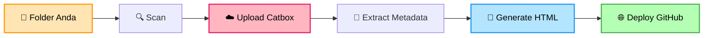
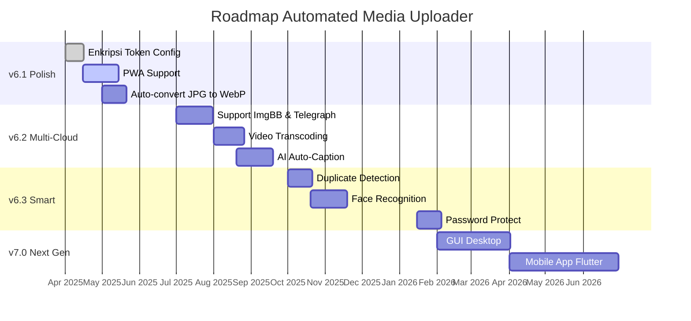

<div align="center">


<h3><i>"Repo Gratis Yang Mengubah Folder Jadi Website Yang Keren"</i></h3>

<p>


</p>

</div>

---

## 📖 Daftar Isi

| 🎯 Untuk Pemula | 🚀 Untuk Lanjutan |
|:----------------|:------------------|
| [Kenalan Dulu Yuk](#-kenalan-dulu-yuk) | [Dari Lokal ke Online](#-dari-lokal-ke-online) |
| [Dongeng Singkat](#-dongeng-singkat) | [Fitur Lengkap](#-fitur-lengkap) |
| [Quick Start](#-quick-start) | [Roadmap](#-roadmap) |
| [Tutorial Lengkap](#-tutorial-lengkap) | [Troubleshooting](#-troubleshooting) |
| [Setup Userhash (WAJIB)](#-setup-userhash-catbox-wajib) | [Support & Donasi](#-support--donasi) |

---

## ✨ Kenalan Dulu Yuk

### 💭 *"Foto yang tidak pernah dibuka, sama saja tidak ada."*

Berapa dari **ribuan foto** di HP Anda yang pernah dilihat **lebih dari sekali**?

- 📱 Terakhir buka galeri HP kapan? *(Scroll 5 menit, eh tiba-tiba 3 jam)*
- 🔍 Pernah nyari foto lama, tapi **tidak ketemu**?
- 😢 Ada momen penting yang **kenangannya hilang** karena HP rusak?

Foto itu bukan cuma file. Itu **memori**. Tapi begitu teronggok di HP, dia jadi:

- 📁 File `IMG_20240315_142301.jpg` yang **tidak ada artinya**
- 🗑️ Yang akan dihapus saat memori penuh
- 🕳️ Yang hilang saat HP ganti

### 🎯 Misi Script Ini

> **"Bawa memori Anda dari folder HP ke internet — agar tidak hilang, agar bisa dibuka kapan saja, agar bisa dibagikan ke orang yang Anda cintai."**

**Automated Media Uploader v6** adalah **script Python** yang mengubah folder lokal menjadi **website galeri online** — gratis, tanpa coding, tanpa hosting bulanan.

### 📊 Alur Kerja



**3 menit setup. 1 klik upload. Langsung online.** 🚀

---

## 📖 Dongeng Singkat

### *"Kisah Tentang Foto yang Tidak Pernah Dibuka"*

---

**Dahulu kala**, di sebuah HP yang penuh sesak...

Hiduplah **10.000 foto**. Mereka tinggal di folder-folder bernama `DCIM`, `Camera`, `WhatsApp Images`.

Setiap hari, foto-foto itu berharap... *"Semoga hari ini aku dibuka oleh tuanku."*

Tapi setiap hari, jawabannya sama: **Tidak.**

📱 Tuan mereka sibuk. Tuan mereka lupa bahwa mereka ada.

---

Suatu hari, **HP itu rusak**. Motherboard konslet. Tidak bisa dinyalakan.

**10.000 foto — lenyap. Selamanya.** Tidak ada yang menyelamatkan mereka. Karena tidak ada backup.

---

### 🌟 TAPI...

Di sebuah repo GitHub yang jauh, hiduplah **script Python** yang baik hati.

Namanya: **Automated Media Uploader v6**.

> **"Aku akan menyelamatkan foto-foto yang terancam hilang. Aku akan bawa mereka ke cloud. Aku akan buatkan mereka rumah baru — website galeri yang cantik. Dan semuanya, GRATIS."**

---

### 🎁 Hadiah dari Script Ajaib

| Hadiah | Nilai | Harga |
|--------|:-----:|:-----:|
| 🐍 Script Python | Rp 500rb | 🆓 |
| 🏷️ Auto-tag (EXIF+OCR+Wajah) | Rp 300rb | 🆓 |
| 🎨 10 tema galeri | Rp 200rb | 🆓 |
| 📐 6 layout responsif | Rp 150rb | 🆓 |
| ☁️ Cloud backup | Rp 400rb | 🆓 |
| 🌐 Website hosting | Rp 350rb | 🆓 |
| **TOTAL** | ~~**Rp 1.900.000+**~~ | **Rp 0** |

**✨ Bonus:** View counter, peta GPS, multi-device, open source.

---

### 🚀 Akhir Kisah Ini Terserah Anda

**Pilihan A:** Tutup README ini, dan tetap punya 10.000 foto yang tidak pernah dibuka.

**Pilihan B:** Ketik `git clone`, jalankan `python main.py`, dan **selamatkan memori Anda.**

### 🎯 Pilih B. 👇

> 💝 **Kenapa gratis?** Karena author baik hati. Kalau bermanfaat, traktir kopi saja ☕

---

## ⚡ Quick Start

```bash
# 1. Clone repository
git clone https://github.com/nexterade/automated-media-uploader.git
cd automated-media-uploader

# 2. Install dependencies
pip install requests requests-toolbelt Pillow

# 3. Jalankan script
python main.py

# 4. Menu 1 -> Setup Wizard (WAJIB isi userhash!)
# 5. Menu 3 -> Upload & Generate
# 6. Buka index.html
```

### 📦 Dependencies

| Package | Status | Fungsi |
|---------|:------:|--------|
| `requests` | Wajib | HTTP client |
| `requests-toolbelt` | Opsional | Streaming upload |
| `Pillow` | Opsional | EXIF + thumbnail |
| `pytesseract` | Opsional | OCR |
| `opencv-python-headless` | Opsional | Face detection |
| `ffmpeg` | Opsional | Video thumbnail |

> Jika opsional tidak ada, fitur terkait **dinonaktifkan otomatis** — script tetap jalan.

---

## 📚 Tutorial Lengkap

### 🛠️ Step 1: Install Python & Dependencies

**Termux (Android):**

```bash
pkg update && pkg upgrade -y
pkg install python git ffmpeg tesseract -y
pip install requests requests-toolbelt Pillow pytesseract opencv-python-headless
```

**Ubuntu / Debian:**

```bash
sudo apt update
sudo apt install python3 python3-pip git ffmpeg tesseract-ocr -y
pip3 install requests requests-toolbelt Pillow pytesseract opencv-python-headless
```

**Windows:**

1. Download [Python](https://python.org) — centang **"Add Python to PATH"**
2. Download [FFmpeg](https://ffmpeg.org/download.html) — tambahkan ke PATH
3. Install dependencies:

```cmd
pip install requests requests-toolbelt Pillow
```

---

### 📁 Step 2: Folder Media — Apa yang Script Baca

Script **tidak mewajibkan** struktur folder atau nama file tertentu.

**Folder default:** `./media`

**Cara kategorisasi:**

- File di subfolder apapun -> kategori = **nama folder tersebut**
- File di root `media/` -> kategori = **"General"**

**Format tanggal yang dideteksi otomatis:**

| Pattern | Contoh |
|---------|--------|
| `YYYYMMDD_HHMMSS` | `20240315_143022` |
| `YYYY-MM-DD` | `2024-03-15` |
| `DD-MM-YYYY` | `15-03-2024` |
| `YYYYMMDD` | `20240315` |
| `DDMMYYYY` | `15032024` |
| `YYYY-MM` | `2024-03` |

**Contoh penamaan:** `pantai_2024-03-15.jpg` lebih baik dari `IMG_1234.jpg`

---

### 🔧 Step 3: Buat Shortcut (Opsional)

**Alias untuk Termux / Linux / macOS:**

```bash
nano ~/.bashrc
```

Tambahkan baris berikut di akhir file:

```bash
alias v6='cd ~/automated-media-uploader && python main.py'
alias v6dir='cd ~/automated-media-uploader'
alias v6update='cd ~/automated-media-uploader && git pull'
```

Simpan dengan `Ctrl+X` -> `Y` -> `Enter`, lalu reload:

```bash
source ~/.bashrc
```

**Windows:** Buat file `v6.bat` di folder project:

```batch
@echo off
cd /d "%~dp0"
python main.py
pause
```

---

### 🎮 Step 4: Jalankan & Pahami Menu

```bash
python main.py
```

**Menu Utama:**

| Menu | Aksi |
|:----:|------|
| **1** | ⚙️ Setup Konfigurasi (Wizard) |
| **2** | ✏️ Edit Konfigurasi Cepat |
| **3** | 🚀 Upload & Generate |
| **4** | 👁️ Preview Konfigurasi |
| **5** | 🗑️ Hapus Cache Upload |
| **6** | 🧹 Bersihkan Thumbnail |
| **7** | 📂 Cek Isi Folder Media |
| **8** | 📖 Bantuan & Tutorial |
| **9** | ⚙️ Generate Manager HTML |
| **10** | 🛠️ Tools & Utilities |
| **0** | 🔄 Reset Blacklist |
| **99** | ❌ Keluar |

**Wizard 9 Langkah:**

| Step | Field | Wajib? |
|:----:|-------|:------:|
| 1/9 | 🔑 Userhash Catbox | ⭐ **YA** |
| 2/9 | 📝 Judul Project | ✅ |
| 3/9 | 🔢 Counter Namespace | ✅ |
| 4/9 | 📁 Folder Media | ✅ |
| 5/9 | ⚙️ Workers (1-4) | ✅ |
| 6/9 | 🐙 GitHub Username | Opsional |
| 7/9 | 📦 GitHub Repo | Opsional |
| 8/9 | 🔑 GitHub Token | Opsional |
| 9/9 | 🌿 Branch & Auto | Opsional |

---

## 🔑 Setup Userhash Catbox (WAJIB)

> ⚠️ **Kenapa WAJIB?** Dari analisis kode `upload_to_catbox()` di `main.py`.

### ❌ Tanpa Userhash (Anonymous)

| Masalah | Dampak |
|---------|--------|
| Rate limit ketat | ~beberapa file per 30 menit |
| Sering gagal | Server tolak request berulang |
| Tidak bisa manage | Tidak bisa hapus/edit file |
| Batch pause lama | 60 detik tiap 30 file |
| Risiko IP diblokir | Temporary ban |

### ✅ Dengan Userhash

| Benefit | Penjelasan |
|---------|-----------|
| Upload stabil | Tanpa rate limit ketat |
| Lebih cepat | Upload ribuan file lancar |
| Manage file | Bisa hapus via Catbox panel |
| Ownership jelas | File terhubung akun Anda |
| Hindari banned | Server kenali Anda sebagai user terdaftar |

### 📝 Cara Mendapatkan Userhash

**Step 1:** Buka [catbox.moe](https://catbox.moe) -> klik **Create Account** -> isi form -> verifikasi email.

**Step 2:** Login -> buka [catbox.moe/user/manage.php](https://catbox.moe/user/manage.php) -> scroll ke **"User Hash"** -> **COPY**.

Format userhash (16-32 karakter hex):

```
a1b2c3d4e5f6789012345678abcdef01
```

**Step 3:** Paste di wizard Step 1/9.

**Cara Alternatif — Edit Manual:**

Edit file `config.json`:

```json
{
  "userhash": "userhash_anda_di_sini"
}
```

**Step 4:** Test upload via menu 3. Kalau lancar tanpa rate limit, userhash valid! ✅

> 🔐 **Jangan share userhash** ke publik — treat seperti password!

---

## 🚀 Upload & Generate (Menu 3)

Setelah wizard selesai, pilih **menu 3**. Script menjalankan `scan_and_upload()`:

```
[1/5] 📂 Scan folder media...
[2/5] ☁️ Upload ke Catbox.moe...
[3/5] 🧠 Extract metadata...
[4/5] 📄 Generate index.html...
[5/5] ⚙️ Generate manager.html...
```

### 📊 Output Akhir

Dari `print_summary_report()`:

```
======================================================
        📊 ATOS BERES BOSS!
======================================================
 📂 Total File Terdeteksi   : X file
 ⚡ Menggunakan Cache       : X file
 ✅ Berhasil Diupload       : X file
 ❌ Gagal Diupload          : X file
------------------------------------------------------
 🕐 Mulai                   : HH:MM:SS
 🕐 Selesai                 : HH:MM:SS
 ⏱️  Durasi                  : Xm Xs
------------------------------------------------------
 🌐 Kuota Internet Dipakai  : X MB
 🚀 Rata-rata Kecepatan     : X MB/s
------------------------------------------------------
```

### 📤 Prompt Setelah Upload

```
📤 Upload hasil ke GitHub sekarang? (y/n) [n]:
```

- Ketik `y` -> push ke GitHub (butuh token)
- Ketik `n` atau Enter -> simpan lokal

### 👁️ Buka Galeri

```bash
# Cara 1: Buka langsung
termux-open index.html          # Termux
xdg-open index.html             # Linux
open index.html                 # macOS
start index.html                # Windows
```

```bash
# Cara 2: Serve via HTTP (recommended)
python -m http.server 8000
# Buka http://localhost:8000
```

---

## 🌐 Dari Lokal ke Online

### 🎯 Deploy ke GitHub Pages (GRATIS)

**Step 1: Buat Akun GitHub**
Buka [github.com/signup](https://github.com/signup) -> isi form -> verifikasi email.

**Step 2: Buat Repository**
Klik `+` -> **New repository** -> isi nama -> pilih **Public** -> Create.

**Step 3: Buat Personal Access Token**
Buka [github.com/settings/tokens](https://github.com/settings/tokens) -> **Generate new token (classic)** -> scope: ✅ **`repo`** -> **SALIN TOKEN** (hanya muncul sekali!).

Format token: `ghp_xxxxxxxxxxxxxxxx`

**Step 4: Aktifkan GitHub Pages**
Buka repo -> **Settings** -> **Pages** -> Source:

- Branch: `main`
- Folder: `/ (root)`
- Save

**Step 5: Deploy via Script**
Jalankan menu 3 -> jawab `y` saat ditanya GitHub.

Galeri online di: `https://USERNAME.github.io/NAMA-REPO/`

### 🔄 Update Konten Nanti

```bash
# 1. Copy foto baru
cp foto_baru.jpg media/

# 2. Jalankan script
python main.py

# 3. Menu 3 -> jawab "y" saat ditanya GitHub
```

---

## 📊 Fitur Lengkap

### 📤 Upload Engine

- Upload ke Catbox.moe, max **200 MB per file**
- Progress bar real-time
- Auto retry **3x** untuk kegagalan
- Handle rate limit HTTP 429 (delay 15s, 30s, 45s)
- Fallback anonymous jika userhash invalid
- Batch pause **60 detik setiap 30 file**
- Multi-thread 1-4 workers
- Cache system hindari upload ulang
- Verifikasi ukuran file upload

### 🧠 Metadata Extraction

- **EXIF lengkap** — kamera, lensa, ISO, f-number, exposure, focal
- **GPS coordinates** — lat/lon untuk peta
- **Auto-tag** dari nama file + EXIF + folder
- **6 format tanggal** otomatis dideteksi
- **OCR** via Tesseract (opsional)
- **Deteksi wajah** via OpenCV (opsional)
- **Deteksi warna dominan**
- **Thumbnail video** via FFmpeg (opsional)
- **Thumbnail gambar** via Pillow (opsional)

### 🎨 Galeri HTML Modern

- **10 tema** — Dark, Light, Midnight, Sunset, Forest, Rose Gold, AMOLED, Cyberpunk, Sepia, macOS
- **6 layout** — Mosaic, Grid, List, Cinema, Magazine, Seamless
- **3 density** — Compact, Normal, Comfortable
- **5 sorting** — date_desc, date_asc, size_desc, size_asc, views_desc
- Search real-time & filter lengkap
- Lightbox dengan zoom, swipe, pinch
- View counter via Abacus API
- Peta lokasi via Leaflet
- Statistik top 10 populer
- Share ke sosial media

### 🛠️ Tools & Utilities

- GitHub auto-deploy
- HTML compressor (minify)
- CSV export
- Project backup (zip)
- URL verifier
- Cache fixer
- Manager HTML panel

### 📁 Format Didukung

- **Gambar:** `.jpg`, `.jpeg`, `.png`, `.webp`, `.gif`, `.svg`, `.ico`
- **Video:** `.mp4`, `.mkv`, `.webm`, `.mov`

---

## 🗺️ Roadmap

### 📊 Timeline Visual



### 📊 Progress Overview

```
v6.0 ████████████████████████████████ 100% ✅ RILIS
v6.1 ████████████░░░░░░░░░░░░░░░░░░░░  40% 🚧 IN PROGRESS
v6.2 ████░░░░░░░░░░░░░░░░░░░░░░░░░░░░  10% 📅 PLANNED
v6.3 ░░░░░░░░░░░░░░░░░░░░░░░░░░░░░░░░   0% 💭 BACKLOG
v7.0 ░░░░░░░░░░░░░░░░░░░░░░░░░░░░░░░░   0% 💭 VISION
```

### 🎯 Highlight per Versi

**🔷 v6.1 — Polish (Q2 2025) — 40%**

- ✅ Enkripsi token di config
- 🚧 PWA support
- 📅 Auto-convert JPG -> WebP
- 📅 Auto dark mode
- 📅 Dashboard analytics

**🔷 v6.2 — Multi-Cloud (Q3 2025) — 10%**

- 📅 Support ImgBB & Telegraph
- 📅 Video transcoding otomatis
- 📅 AI auto-caption
- 📅 Multi-language UI

**🔷 v6.3 — Smart (Q4 2025) — 0%**

- 💭 Duplicate detection
- 💭 Face recognition
- 💭 Timeline view
- 💭 Password protect

**🔷 v7.0 — Next Gen (2026) — 0%**

- 💭 GUI Desktop (Tauri)
- 💭 Mobile App (Flutter)
- 💭 Auto-sync watch folder
- 💭 Multi-user support

---

## 🛠️ Troubleshooting

### 🔥 Error: ModuleNotFoundError

```bash
pip install requests requests-toolbelt Pillow pytesseract opencv-python-headless
```

### 🔥 Upload gagal terus

Cek list berikut:

- [ ] Koneksi internet OK?
- [ ] **Userhash sudah diisi?** (WAJIB!)
- [ ] File < 200 MB?
- [ ] Coba `workers = 1`

**Fix cache:** Menu 10 -> 6

### 🔥 Gambar tidak muncul di HTML

1. Cek URL Catbox di browser
2. Hapus cache: Menu 5 -> y
3. Upload ulang: Menu 3
4. Verifikasi: Menu 10 -> 5

### 🔥 GitHub push failed

- Buat token baru dengan scope `repo`
- Update di config: Menu 2 -> 8
- Pastikan branch = `main`

### 🔥 Reset Total

```bash
rm config.json uploads_cache.json deleted.json
python main.py
# Menu 1 — Setup ulang
```

---

## 💎 Support & Donasi

### 💖 Kalau project ini bermanfaat, dukung author!

### ☕ Traktir Kopi

| Indonesia | Internasional |
|:---------:|:-------------:|
| [](https://saweria.co/nexterade) | [](https://ko-fi.com/nexterade) |

### 🪙 Crypto Donation

#### ₿ Bitcoin (BTC)

```
bc1qxy2kgdygjrsqtzq2n0yrf2493p83kkfjhx0wlh
```

#### Ξ Ethereum (ETH)

```
0x71C7656EC7ab88b098defB751B7401B5f6d8976F
```

#### ₮ USDT (TRC-20)

```
TN9RRaXkCFtTXRso2GdTZxSxxwBb2dFd4S
```

#### ◎ Solana (SOL)

```
DYw8jCTfwHNRJhhmFcbXvVDTqWMEVFBX6ZKUmG5CNSKK
```

> 💡 Scan dengan crypto wallet, atau copy-paste. Pastikan network sesuai sebelum kirim!

### 🎁 Cara Lain Mendukung

| ⭐ Star Repo | 🐛 Report Bug | 📢 Share | 🤝 Kontribusi |
|:-----------:|:-------------:|:--------:|:-------------:|
| Di GitHub | Bantu perbaiki | Ke teman | Pull request |

---

## 👨‍💻 Author

<div align="center">


<br>

### @nexterade

*Full-stack Developer • Automation Enthusiast • Indonesia* 🇮🇩

<p>
<a href="https://github.com/nexterade"></a>
<a href="https://t.me/nexterade"></a>
<a href="mailto:contact@nexterade.dev"></a>
</p>

### *"Code with passion, share with love."*

Developer yang suka bikin tool automation untuk mempermudah hidup.
Project ini awalnya dibuat untuk kebutuhan pribadi, lalu di-open source.

</div>

---

## 📄 Lisensi

**MIT License** — Bebas digunakan, dimodifikasi, didistribusikan.

```
Copyright (c) 2025 @nexterade

Permission is hereby granted, free of charge, to any person obtaining a copy
of this software and associated documentation files (the "Software"), to deal
in the Software without restriction, including without limitation the rights
to use, copy, modify, merge, publish, distribute, sublicense, and/or sell
copies of the Software, and to permit persons to whom the Software is
furnished to do so, subject to the following conditions:

The above copyright notice and this permission notice shall be included in all
copies or substantial portions of the Software.

THE SOFTWARE IS PROVIDED "AS IS", WITHOUT WARRANTY OF ANY KIND.
```

---

<div align="center">


## ⭐ Kalau bermanfaat, jangan lupa star! ⭐

```
╔═══════════════════════════════════════════════╗
║   📸 Upload  ->  🎨 Generate  ->  🌐 Deploy  ║
║                                               ║
║   Repo Gratis Yang Mengubah Folder            ║
║   Jadi Website Yang Keren                     ║
║                                               ║
║   Made with ❤️  in Indonesia 🇮🇩              ║
╚═══════════════════════════════════════════════╝
```

</div>
